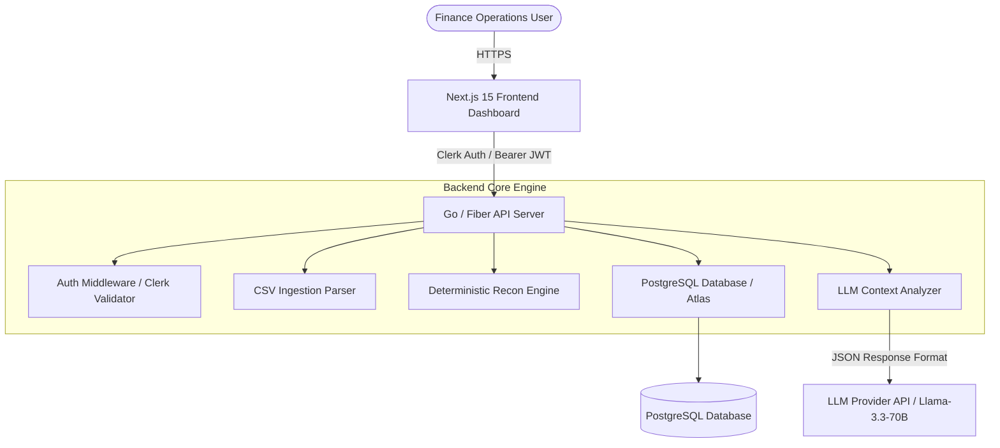

# Financial Reconciliation & Intelligence System

A robust, enterprise-grade automated reconciliation engine and financial dashboard designed to ingest, match, and audit transactional datasets across e-commerce order management systems (OMS) and payment gateway processors.

The platform deterministically detects revenue leakage, payment anomalies, duplicate charges, and data integrity issues, providing finance operations teams with clear headline metrics, discrepancy drill-down capabilities, and LLM-assisted root-cause explanations.

---

## Architecture Overview

The application follows a clean, decoupled architecture separating the deterministic execution engine on the backend from the modern visual presentation layer on the frontend.



### Technology Stack

- **Backend**: Go (1.26), Gin Framework, PostgreSQL, Atlas Schema Migration Engine.
- **Frontend**: Next.js 16 (App Router), React 19, TypeScript, Tailwind CSS, Lucide Icons.
- **Authentication**: Clerk Authentication (JWT verification and session management).
- **LLM Integration**: Server-side LLM completion client (Groq / OpenAI compatible) enforcing structured JSON outputs.

---

## Reconciliation Engine Logic & Business Rules

The core reconciliation engine operates deterministically to ensure repeatable and verifiable audit results. The pipeline maps every record from the store's order system (`orders.csv`) against the payment gateway logs (`payments.csv`).

### Matching Methodology

Records are joined on the primary business key: `order_id` (Store Order ID) matched against `order_reference` / `order_id` in the payment processor data.

### Discrepancy Taxonomy & Precedence Hierarchy

To prevent cascading discrepancy reporting, records undergo evaluation through a strict precedence hierarchy:

| Hierarchy | Discrepancy Type          | Description                             | Trigger Condition                                                             |
| :-------- | :------------------------ | :-------------------------------------- | :---------------------------------------------------------------------------- |
| **1**     | `DUPLICATE_ORDER_ENTRY`   | Duplicate order record in source CSV    | Multiple order records present with identical business `order_id`.            |
| **2**     | `UNPAID_ORDER`            | Store order completed with no payment   | Order marked `completed` but zero matching payment records exist.             |
| **3**     | `MISSING_PROCESSED_AT`    | Audit metadata gap in processor         | Matched payment record lacks a `processed_at` timestamp.                      |
| **4**     | `DUPLICATE_CHARGE`        | Multiple capture charges for one order  | More than one `charge` transaction linked to the same order.                  |
| **5**     | `PAYMENT_FAILED`          | Order completed despite payment failure | Store order status is `completed`, but payment status is `failed`.            |
| **6**     | `CANCELLED_ORDER_SETTLED` | Order cancelled but payment retained    | Store order status is `cancelled`, but payment status is `settled`.           |
| **7**     | `CURRENCY_MISMATCH`       | Currency mismatch between systems       | Order currency code differs from payment processor currency code.             |
| **8**     | `AMOUNT_MISMATCH`         | Value discrepancy exceeds tolerance     | Difference between order net amount and payment amount exceeds `$0.01`.       |
| **9**     | `PAYMENT_PENDING`         | Order completed while payment pending   | Store order status is `completed`, but payment processor status is `pending`. |
| **10**    | `ORPHAN_PAYMENT`          | Unlinked payment charge/settlement      | Payment transaction exists in gateway with no corresponding store order.      |

### Tolerances & Decision Rationale

- **Amount Tolerance (`$0.01`)**: A threshold of absolute difference `|order_net - payment_amount| > 0.01` is applied to eliminate false positives arising from minor floating-point rounding errors during currency conversions.
- **Deterministic Pipeline**: Matching and categorization rely strictly on deterministic code logic. Machine learning / LLMs are explicitly excluded from the matching process to guarantee consistency and regulatory audit compliance.

---

## Dataset Findings & Business Risk Audit

An analysis of the sample `orders.csv` and `payments.csv` datasets revealed significant operational and financial vulnerabilities:

1. **Direct Revenue Leakage (`CANCELLED_ORDER_SETTLED` & `UNPAID_ORDER`)**:
   - Multiple orders marked as `cancelled` in the store system still had funds collected and settled by the gateway without issuing customer refunds, creating legal compliance and chargeback risks.
   - Orders marked as `completed` had missing payment references, indicating systemic failure in order-fulfillment webhooks.

2. **Customer Overcharging & Financial Liability (`DUPLICATE_CHARGE`)**:
   - Multiple settled charge transactions were tied to individual single-item orders, indicating retry mechanism bugs in the gateway integration resulting in customer double-billing.

3. **Settlement Discrepancies (`AMOUNT_MISMATCH` & `CURRENCY_MISMATCH`)**:
   - Currency code discrepancies (e.g., store charging in USD while gateway settled in EUR without proper FX accounting) caused discrepancies between expected store revenue and actual bank deposits.

4. **Data Hygiene & Metadata Gaps (`MISSING_PROCESSED_AT`)**:
   - Several payment records lacked timestamp metadata, compromising end-of-day financial ledger reconciliation and audit trails.

---

## LLM Integration Architecture

The platform embeds an LLM-assisted explanation layer to translate raw reconciliation discrepancies into plain-language business insights and action items.

### Key Security & Backend Isolation

- The LLM service is executed **strictly on the backend**. API keys are never exposed to client-side code or committed to repository source control.

### Structured Output Protocol

To guarantee reliable UI parsing, the system prompts the LLM to return a strict JSON schema:

```json
{
	"summary": "1-2 sentence overview of the issue",
	"root_cause": "Detailed explanation of systemic origin",
	"business_impact": "Quantified financial and operational risk",
	"recommended_actions": [
		"Step-by-step mitigation item 1",
		"Step-by-step mitigation item 2"
	]
}
```

### Temperature Selection (`0.2`)

The LLM completion temperature is explicitly set to **`0.2`**.

- **Rationale**: Financial audit contexts require high determinism, factual consistency, and low variance. A low temperature minimizes model creativity and hallucination risk, ensuring concise, analytical explanations grounded strictly in the provided record data.

### Robustness & Error Handling

- **JSON Sanitization**: Backend response handlers automatically strip markdown code-block wrappers (` ```json ... ``` `) before JSON unmarshalling.
- **Graceful Fallbacks**: If the LLM provider fails, times out, or returns a malformed response, the API gracefully degrades by serving deterministic fallback error responses without crashing the dashboard experience.

---

## Local Development & Setup

### Prerequisites

- **Docker** & **Docker Compose**
- **Go** (v1.25 or higher)
- **Node.js** (v22 or higher) & **pnpm** / **npm**
- **PostgreSQL** (v16 or higher)

### Environment Configuration

Create `.env` files for backend and frontend based on `.env.example`:

```bash
cp .env.example backend/.env
cp .env.example frontend/.env
```

### Option A: Docker Compose (Recommended)

To run the database and backend in containers:

```bash
docker compose up --build
```

Access services:

- **Backend API**: `http://localhost:3000`
- **PostgreSQL**: `localhost:5432`

Run the frontend locally:

```bash
cd frontend
pnpm install
pnpm dev
```

- **Frontend Application**: `http://localhost:3001` (or next available port)

---

### Option B: Manual Setup

#### 1. Start Database

Ensure PostgreSQL is running locally and create database `paydash`:

```bash
createdb paydash
```

#### 2. Run Backend

```bash
cd backend
go run cmd/api/main.go
```

#### 3. Run Frontend

```bash
cd frontend
pnpm install
pnpm dev
```

---

## Future Improvements & Roadmap

With additional development time, the following enhancements are planned:

1. **Fuzzy & Heuristic Order Matching**: Implement Levenshtein and Jaro-Winkler string distance algorithms to match transaction references with slight typos or prefix variations.
2. **Real-time FX Rate Integration**: Integrate external foreign exchange rate APIs to automatically calculate converted amounts for multi-currency transactions.
3. **Automated Refund & Resolution Workflows**: Provide one-click triggers from the dashboard to issue refunds or trigger webhook re-syncs directly to payment gateways.
4. **Streaming CSV & Large File Processing**: Implement chunked streaming ingestion for multi-gigabyte reconciliation files using background worker queues.

---

## AI Assistance & Attribution

AI tools (including Cursor and Antigravity pair programming assistants) were utilized during the development of this project for rapid boilerplate setup, Go data model drafting, unit test creation, and refining UI tailwind components. All architectural design decisions, reconciliation logic rules, and security controls were verified and validated manually.
